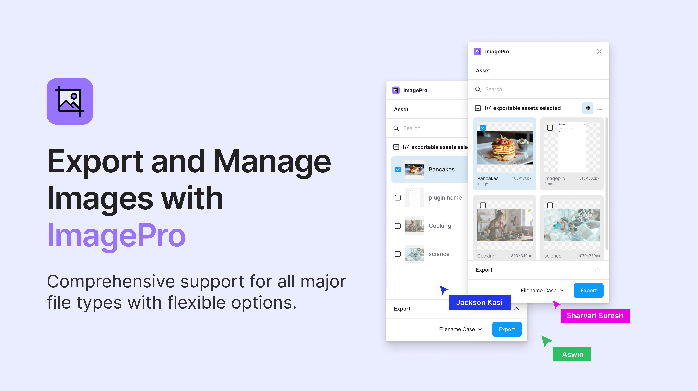

# ImagePro Export

[](https://www.figma.com/community/plugin/1379136407205425732/imagepro-export) 👈 Try this✨



ImagePro Export is a versatile plugin designed to enhance your image export experience. It provides various export options, filter settings, scaling features, and convenient renaming capabilities, making it an invaluable tool for developers and designers.

## Features

- 🌟 **Export Options:** Export images in PNG, JPG, WEBP, SVG, and PDF formats. Choose your preferred file format for export.
- 🖋️ **Case Change Options:** Customize the case format of your exported file names. Available options include camelCase, snake_case, kebab-case, and PascalCase.
- 🔍 **Search Functionality:** Easily filter images by their prefix using the search input. Quickly find and export specific images from your Figma file.
- 📏 **Scale Options:** Export images at different scales: 1x, 2x, 2.5x, 3x, 4x. Perfect for creating assets at various resolutions.
- 🌗 **Light & Dark Mode Support:** Enjoy a seamless experience with both light and dark mode support.
- ⚙️ **Customizable Plugin Options:** Resize the plugin window to suit your workflow. Adjust plugin settings to match your preferences.
- 📁 **Organized Downloads:** Download images as a ZIP file, organized by scale option. Keep your exported assets neatly structured for easy access.
- 📉 **Image Compression:** Compress images based on quality settings to save space.

### Upcoming Features

- 🖼️ **Export as RGB, CMYK, or Greyscale**
- 🏷️ **Option Image Options - AVIF**
- 📉 **Modify Specific Image Quality for Compression**
- 🔒 **User Auth**
- 📤 **Share Single/Multiple Images**
- 🌐 **AI Pro: Remove Background, Upscale Image, Text to Image Generation**
- ☁️ **Cloud Management: Search Uploaded Images, Get Sharable Link of File/Folder, Delete Files/Folder**
- 🔜 **Your Ideas:** Have a feature in mind? Share your thoughts, and it might become a feature! ✨🤗

## Installation

1. Clone the repository:

   ```bash
   git clone https://github.com/yourusername/imagepro-export.git
   ```

2. Navigate to the project directory:

   ```bash
   cd plugin
   ```

3. Install the dependencies:

   ```bash
   bun install
   ```

4. Run the application:

   ```bash
   bun dev
   ```

## Contributing

We welcome contributions! Please fork the repository and submit pull requests for any enhancements or bug fixes.

## Donate

If you like my work and would like to support me, please consider donating via [Ko-fi](https://ko-fi.com/jacksonkasi). Your support is greatly appreciated!😊

[](https://ko-fi.com/jacksonkasi)

## License

This project is licensed under the MIT License. See the [LICENSE](LICENSE) file for details.

## Seeking UI/UX Designer Volunteers 🤝

I am seeking a UI/UX designer to help improve the plugin's user interface and user experience. If you are interested, please reach out at <jacksonkasipeacock@gmail.com>

## Feature Checklist

- [x] Auto fetch image from Figma
- [x] Search Image to Filter
- [x] Multi Select Image
- [x] Scale Option
- [x] Case change options
- [x] Export options - PNG, JPG, WEBP, SVG, PDF
- [x] Export with Compressed
- [x] Save files in .zip
- [x] Light & Dark mode support
- [ ] Option Image options - AVIF
- [ ] Export as RGB, CMYK or Greyscale
- [ ] Modify Specific Image Quality for Compression
- [ ] User Auth
- [ ] Share single/multiple images

### AI Pro Features

- [ ] Remove Background
- [ ] Upscale Image
- [ ] Text to Image generation

### Cloud (Files Management)

- [ ] Search uploaded images
- [ ] Get sharable link of file or folder
- [ ] Delete files/folder
